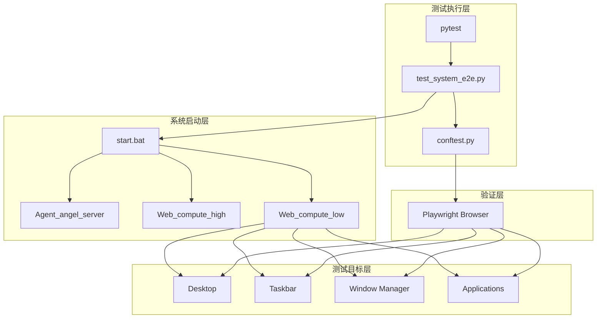
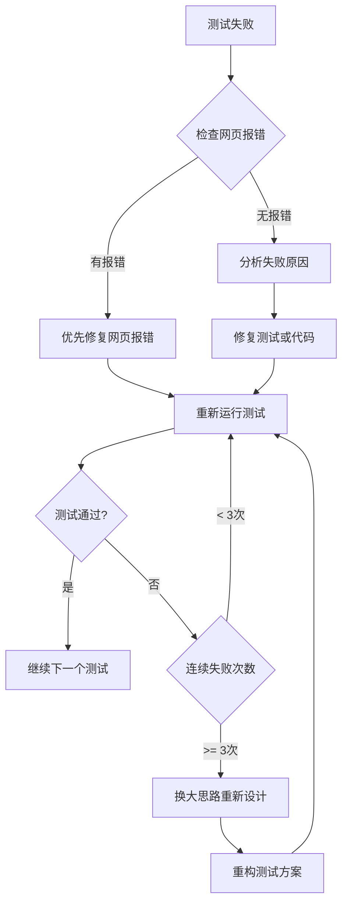

# Design Document: Frontend E2E Tests

## Overview

本设计文档描述了 Web_compute_low 前端系统的端到端测试架构。测试系统将使用 Playwright 自动化测试框架，通过 `start.bat` 启动整个系统后，对前端的 20 个核心功能进行全面测试。

测试框架基于现有的 `Web_compute_low/Debug/frontend-tests` 目录结构，扩展为完整的 E2E 测试套件。

## Architecture



## Components and Interfaces

### 1. 测试配置模块 (conftest.py)

负责测试环境配置、浏览器实例管理、系统启动/关闭。

```python
# 核心配置
TEST_URL = "http://localhost:3000"
HEADLESS = False  # 可视化模式
SLOW_MO = 500     # 操作延迟
STARTUP_TIMEOUT = 60  # 系统启动超时

# Fixtures
- browser: 浏览器实例
- context: 浏览器上下文
- page: 页面实例
- system_startup: 系统启动/关闭管理
```

### 2. 测试用例模块 (test_system_e2e.py)

包含 20 个测试类，每个类对应一个需求：

| 测试类 | 功能 | 测试数量 |
|--------|------|----------|
| TestSystemStartup | 系统启动 | 3 |
| TestPageLoad | 页面加载 | 4 |
| TestDesktopElements | 桌面元素 | 4 |
| TestTaskbar | 任务栏 | 5 |
| TestClock | 时钟显示 | 3 |
| TestWindowManagement | 窗口管理 | 5 |
| TestContextMenu | 右键菜单 | 4 |
| TestWallpaper | 壁纸功能 | 3 |
| TestWindowInteraction | 窗口交互 | 3 |
| TestBrowserApp | 浏览器应用 | 4 |
| TestPerformance | 性能监控 | 3 |
| TestMultiWindow | 多窗口管理 | 3 |
| TestDragOverlay | 拖拽保护 | 3 |
| TestStatePersistence | 状态持久化 | 3 |
| TestKeyboardInteraction | 键盘交互 | 3 |
| TestResponsiveLayout | 响应式布局 | 3 |
| TestErrorHandling | 错误处理 | 3 |
| TestCapsuleComponents | 胶囊组件 | 3 |
| TestLoginInterface | 登录界面 | 3 |
| TestSystemStability | 系统稳定性 | 3 |

### 3. 工具函数模块 (utils/)

```python
# utils/system.py - 系统管理
start_system()      # 启动 start.bat
stop_system()       # 停止系统
wait_for_service()  # 等待服务就绪

# utils/helpers.py - 测试辅助
take_screenshot()   # 截图
wait_for_element()  # 等待元素
measure_time()      # 性能测量
```

## Data Models

### 测试结果数据结构

```python
@dataclass
class TestResult:
    test_name: str
    status: Literal["passed", "failed", "skipped"]
    duration: float
    screenshot_path: Optional[str]
    error_message: Optional[str]

@dataclass
class TestReport:
    total: int
    passed: int
    failed: int
    skipped: int
    duration: float
    results: List[TestResult]
```

### 系统状态数据结构

```python
@dataclass
class SystemStatus:
    is_running: bool
    services: Dict[str, bool]  # service_name -> is_healthy
    startup_time: float
```

## Correctness Properties

*A property is a characteristic or behavior that should hold true across all valid executions of a system-essentially, a formal statement about what the system should do. Properties serve as the bridge between human-readable specifications and machine-verifiable correctness guarantees.*

Based on the prework analysis, the following properties have been identified:

### Property 1: Double-click opens corresponding window
*For any* desktop icon, when a user double-clicks on it, the system should create and display a window with the corresponding application ID.
**Validates: Requirements 3.2**

### Property 2: Opened application appears in taskbar
*For any* application that is opened, the taskbar-apps area should contain an icon element with the application's ID as data attribute.
**Validates: Requirements 4.4**

### Property 3: Window structure consistency
*For any* opened application window (non-frameless), the window should contain a title bar with close and minimize buttons, and a content area.
**Validates: Requirements 6.1**

### Property 4: Window focus on click
*For any* window that is clicked, it should have the highest z-index among all visible windows, indicating it is the active/focused window.
**Validates: Requirements 6.5, 12.2**

## Error Handling

### 系统启动错误

```python
class SystemStartupError(Exception):
    """系统启动失败"""
    pass

class ServiceUnavailableError(Exception):
    """服务不可用"""
    pass
```

### 错误处理策略

1. **启动超时**: 60秒内未启动完成，抛出 SystemStartupError
2. **服务不可用**: 重试3次，每次间隔5秒
3. **测试失败**: 自动截图，记录错误信息
4. **清理失败**: 强制终止进程

### 测试结果判定规则 (严格模式)

**核心原则**: 只有完全通过才算通过，其他情况一律记录为失败。

| 状态 | 判定结果 | 处理方式 |
|------|----------|----------|
| 完全通过 | ✅ PASS | 继续下一个测试 |
| 失败 | ❌ FAIL | 记录失败，尝试修复 |
| 跳过 | ❌ FAIL | 记录为失败，不允许跳过 |
| 半成功/部分通过 | ❌ FAIL | 记录为失败，需完全修复 |
| 超时 | ❌ FAIL | 记录为失败，检查性能问题 |

### 失败处理流程



### 调试优先级

1. **最高优先级**: 修复网页控制台报错 (console.error)
2. **高优先级**: 修复元素定位失败
3. **中优先级**: 修复超时问题
4. **低优先级**: 优化测试稳定性

### 重试策略

```python
MAX_RETRIES = 3  # 单个测试最大重试次数
CONSECUTIVE_FAIL_THRESHOLD = 3  # 连续失败阈值，触发大思路切换

async def run_test_with_retry(test_func, page):
    """带重试的测试执行"""
    for attempt in range(MAX_RETRIES):
        try:
            # 先检查网页报错
            errors = await page.evaluate("window.__console_errors__ || []")
            if errors:
                print(f"⚠️ 发现网页报错，优先修复: {errors}")
                # 记录报错，不进行空想推理
                raise WebPageError(errors)
            
            await test_func()
            return True  # 完全通过
        except Exception as e:
            print(f"❌ 第 {attempt + 1} 次尝试失败: {e}")
            await take_screenshot(page, f"fail_attempt_{attempt + 1}")
            
            if attempt < MAX_RETRIES - 1:
                print("🔄 准备重试...")
                await page.reload()
    
    return False  # 记录为失败
```

## Testing Strategy

### 测试框架选择

- **框架**: pytest + pytest-asyncio
- **浏览器自动化**: Playwright (async API)
- **属性测试**: Hypothesis (用于属性测试)

### 单元测试

单元测试覆盖工具函数和辅助模块：

```python
# tests/unit/test_utils.py
def test_take_screenshot_creates_file():
    """验证截图函数创建文件"""
    pass

def test_wait_for_service_timeout():
    """验证服务等待超时处理"""
    pass
```

### 属性测试 (Property-Based Testing)

使用 Hypothesis 库进行属性测试，每个属性测试运行至少 100 次迭代。

```python
# tests/property/test_properties.py
from hypothesis import given, strategies as st, settings

@settings(max_examples=100)
@given(icon_id=st.sampled_from(available_icons))
async def test_double_click_opens_window(page, icon_id):
    """
    **Feature: frontend-e2e-tests, Property 1: Double-click opens corresponding window**
    **Validates: Requirements 3.2**
    """
    # 双击图标
    await page.dblclick(f'[data-id="{icon_id}"]')
    # 验证窗口打开
    window = page.locator(f'#{icon_id.replace("icon-", "win-")}')
    await expect(window).to_be_visible()
```

### 集成测试

集成测试验证完整的用户流程：

```python
# tests/integration/test_workflows.py
async def test_complete_workflow():
    """测试完整工作流：启动 -> 登录 -> 打开应用 -> 操作 -> 关闭"""
    pass
```

### 测试执行命令

```bash
# 运行所有测试
pytest test_system_e2e.py -v -s

# 运行特定测试类
pytest test_system_e2e.py::TestDesktopElements -v -s

# 运行属性测试
pytest tests/property/ -v -s

# 生成HTML报告
pytest test_system_e2e.py --html=report.html
```

### 测试标注规范

每个属性测试必须包含以下注释：
- `**Feature: {feature_name}, Property {number}: {property_text}**`
- `**Validates: Requirements X.Y**`
